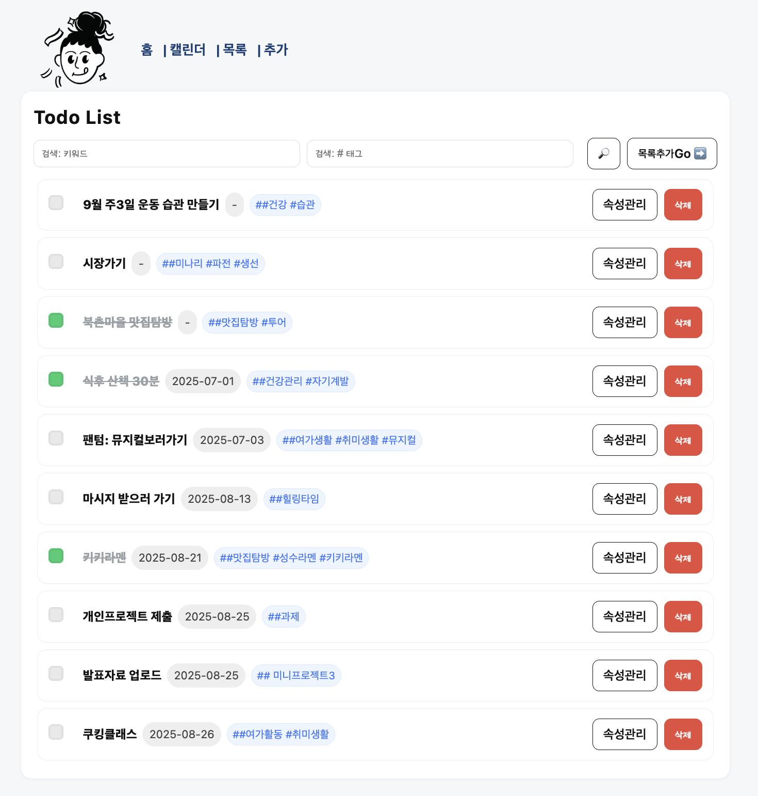
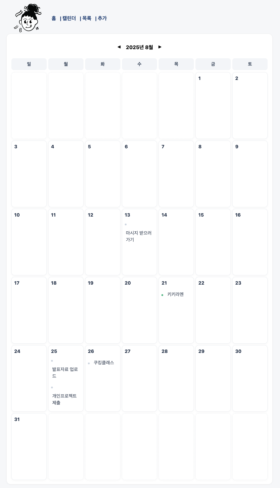
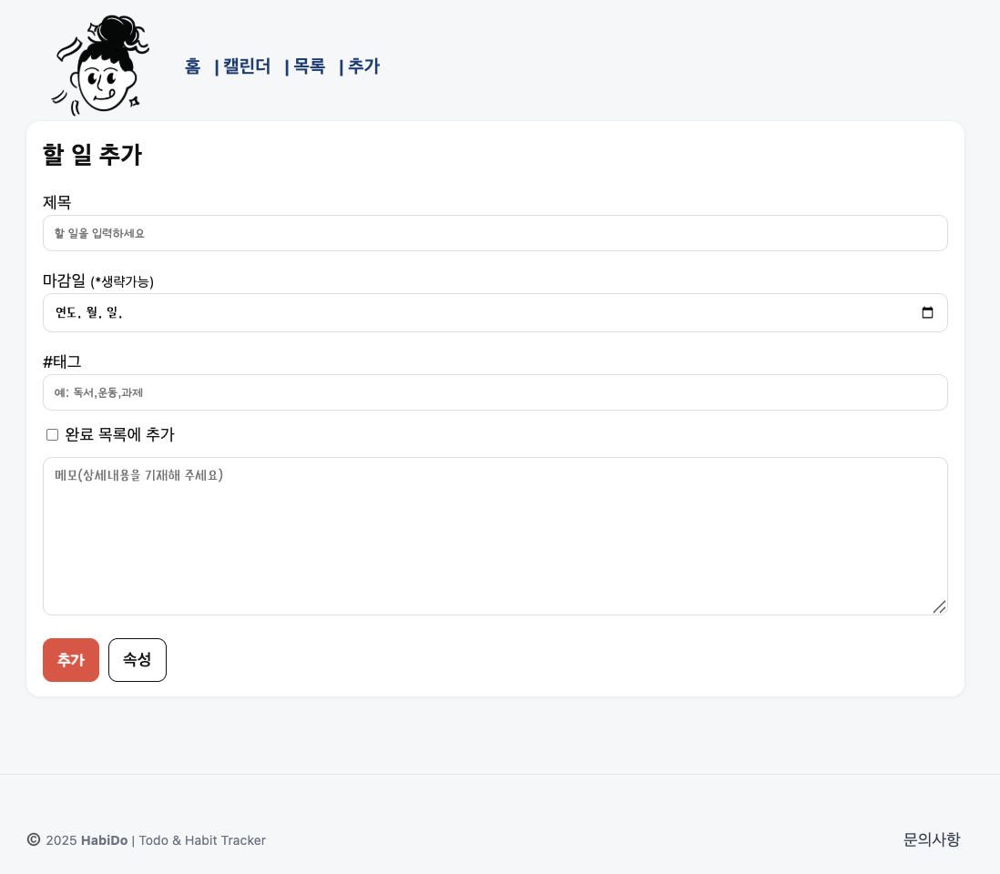

# 할 일 & 습관 Tracker HabiDo 
    본 서비스는 할 일 또는 일정 목록을 관리하고 습관화 하고자 하는 일을 트랰킹 하는 웹 애플리케이션 입니다. 
    사용자는 할일을 등록, 수정, 삭제할 수 있으며, 목록을 생성한 후 세부 속성을 추가하여 진행 상태를 관리 할 수 있습니다. 
 
## 개요 
  1. 할일 목록 관리와 습관 트래킹 기능이 포함된 웹 서비스
  2. 할 일 또는 매일 해야할 일 목록을 등록, 수정, 삭제하고 진행상태(완료여부, 일정 변경 등)을 관리
  3. 달력으로 일정을 확인하며 시각적으로 관리

## 주요 기능
    •	할 일 등록 / 수정 / 삭제 (AJAX 기반 삭제기능 지원)
    •	체크박스로 완료 여부 표시
    • 속성에서 반복적으로 수행하는 요일 표시
    •	태그, 마감일, 메모, 진행기간 관리
    •	Tracking 속성:
      - 진행 상태(완료, 진행중, 일정변경, 기타 등)
      - 속성별 메모 입력 및 요일과 진행기간 입력 가능
      - 항목별 내용 변경사항 저장 및 삭제 가능 
    •	리스트 UI: 선택/체크박스 + 태그 + 날짜 
    •	반응형 레이아웃 및 애니메이션을 적용하여 삭제 시 자연스럽게 사라지게 함

## 기술 스택
	•	Frontend: EJS, CSS (flexbox 레이아웃, 애니메이션)
	•	Backend: Node.js, Express.js
	•	 Database: MongoDB 
	•	기타: Fetch API (AJAX 비동기 처리), RESTful API구조 

  ## 주요 API 라우트 
    •	목록: GET /todo/list → todoList.ejs
    •	입력폼: GET /todo/input → todoInput.ejs
    •	상세: GET /todo/detail?_id=... → todoDetail.ejs
    •	트래킹 항목:
      - 추가 POST /todo/props/add
      - 수정 POST /todo/props/update
      - 삭제 POST /todo/props/delete
    •	완료 토글: POST /todo/toggle
    •	할 일 목록 삭제: POST /todo/delete
    •	달력: GET /calendar

## 📂 프로젝트 구조
      HabiDo_Application/
      ├── app.js
      ├── package.json
      ├── .env
      ├── .gitignore
      ├── public/
      │   ├── styles.css
      │   └── images/
      │       └── logo.PNG
      └── views/
          └── partials/
          │    ├── _head.ejs
          │    ├── _header.ejs
          │    └── _footer.ejs
          ├── home.ejs
          ├── calendar.ejs
          ├── todoInput.ejs
          ├── todoList.ejs
          └── todoDetail.ejs
    ---------------------

## 설치 & 실행 방법
    1) 저장소 클론
      |bash|
      |git clone https://github.com/seirah-yang/HbiDo.git
      |cd todo-tracker-app
    2) 패키지 설치 
      |npm install
    3) 환경변수 설정
      : 프로젝트 루트에 .env 파일생성 
      |.env
      |MONGO_URI=mongodb://localhost:27017/tododb
      |PORT=3030
    4) 서버 실행 
      |bash 
      |npm start

## 화면 리뷰
    •	홈 뷰 : 동기부여 제공하는 페이지와 iframe 작은 달력으로 일정 시각화
      
      
    •	리스트 뷰 : 할 일 목록 확인 및 완료 체크
      
    •	상세 뷰 : 속성 관리 및 기간 선택
      
      
    •	달력 뷰 : 일정 시각화
      
    •	목록추가 뷰 : 할 일 목록 추가
      

## 확장 및 개선 안 
    • 사용자 로그인 & 개별 계정 Todo 관리
    • 사용자/계정 간 일정 공유 및 연동 서비스 
    • 검색 & 필터(날짜별 / 태그별)
    • 캘린더 뷰 개선(정렬, 완료목록, 좌측/우측 사이드 메뉴 활용 등)

  👩‍💻 제작자
	•	양소라 (@Yang Sora)
		: 디자인 기획, 프론트엔드, 백엔드, 데이터 설계
